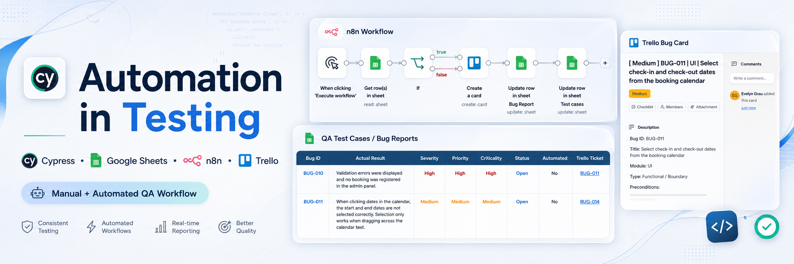
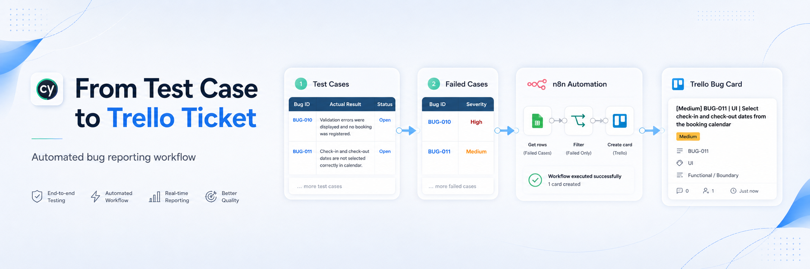

# Testing Project - Automation in Testing

## Project Status

**Status:** Completed

---

## Project Description

This project focuses on the analysis, design, execution, documentation, and automation of tests for the following web application:

https://automationintesting.online/

The application simulates a Bed & Breakfast booking platform called **Shady Meadows B&B**, where users can view available rooms, make reservations, submit contact messages, and access an administration panel.

The objective of this project was to apply manual testing, exploratory testing, functional testing, form validation testing, bug reporting, and Cypress automation in a realistic QA workflow.

The project also includes workflow automation using **n8n**, **Trello**, and **Google Sheets / Excel** to improve bug reporting and traceability.

---

## Participant

* Evelyn Grau

---

## General Objective

Evaluate the correct behavior of the Automation in Testing web application by validating its main user flows, identifying functional, UI, validation, and accessibility issues, and documenting the results through manual and automated QA practices.

---

## Specific Objectives

* Analyze the main functionality of the application.
* Identify critical business flows.
* Design and execute manual test cases.
* Validate positive, negative, and edge case scenarios.
* Automate key test cases using Cypress.
* Use fixtures to manage test data.
* Use custom commands to reduce duplicated Cypress logic.
* Report bugs with clear evidence and reproduction steps.
* Automate bug card creation in Trello using n8n.
* Automatically register Trello ticket numbers in the test case spreadsheet.
* Keep a structured test case and bug report document.
* Document the project clearly in GitHub.

---

## Application Under Test

**Name:** Shady Meadows B&B
**URL:** https://automationintesting.online/
**Type:** Hotel / Bed & Breakfast booking application

Main modules tested:

* Home Page
* Rooms
* Booking Flow
* Contact Form
* Admin Panel
* UI / Accessibility
* Bug Reporting Workflow

---

## Scope of Testing

The testing process covered the following areas:

### Home Page

* Page loading.
* Header navigation.
* Main content visibility.
* Contact section availability.

### Rooms / Booking Section

* Display of available rooms.
* Room names and room cards.
* Room images.
* Booking entry points.
* Navigation to room reservation page.

### Booking Flow

* Room selection.
* Date selection.
* Guest information form.
* Successful booking confirmation.
* Empty form validation.
* Invalid email validation.
* Invalid input validation.
* Validation of past or unavailable dates.

### Contact Form

* Valid contact form submission.
* Required field validation.
* Confirmation message after submission.

### Admin Panel

* Login with valid credentials.
* Login with invalid credentials.
* Booking record validation.
* Contact message validation in admin inbox.

### Accessibility / UI

* Image alt attributes.
* UI consistency.
* Form validation messages.
* Visibility of key elements.

---

## Out of Scope

The following items were not included in this project stage:

* Performance testing.
* Load testing.
* Stress testing.
* Advanced security testing.
* Database-level testing.
* Full cross-browser compatibility testing.
* Full API test suite coverage.

---

## Testing Types Applied

* Functional testing.
* Exploratory testing.
* Smoke testing.
* Regression testing.
* UI testing.
* Form validation testing.
* Negative testing.
* Edge case testing.
* End-to-end testing.
* Basic accessibility validation.
* Automated testing with Cypress.

---

## Tools Used

* Cypress.
* JavaScript.
* Visual Studio Code.
* Google Chrome.
* Chrome DevTools.
* Git.
* GitHub.
* Google Sheets / Excel.
* Trello.
* n8n.
* Screenshots and visual evidence.

---

## Cypress Project Structure

```txt
project-root/
│
├── cypress/
│   ├── e2e/
│   │   └── myTestRestfulBooker.cy.js
│   │
│   ├── fixtures/
│   │   ├── admin.json
│   │   ├── booking.json
│   │   ├── contact.json
│   │   └── rooms.json
│   │
│   └── support/
│       ├── commands.js
│       └── e2e.js
│
├── node_modules/
├── .gitignore
├── cypress.config.js
├── package-lock.json
├── package.json
└── README.md
```

---

## Cypress Files Description

### `cypress/e2e/myTestRestfulBooker.cy.js`

Main Cypress spec file.

It contains the automated test suite for:

* Home page validation.
* Available rooms validation.
* Booking flow.
* Booking form validations.
* Contact form submission.
* Admin panel checks.

The test suite is organized into `describe` blocks according to the tested module.

---

### `cypress/fixtures/admin.json`

Stores admin panel credentials.

Used for:

* Valid admin login.
* Invalid admin login.
* Admin panel validation.

---

### `cypress/fixtures/booking.json`

Stores booking test data.

Used for:

* Valid guest booking.
* Invalid email validation.
* Invalid input validation.
* Past date scenarios.
* Different guest datasets.

Using this fixture keeps test data separated from test logic.

---

### `cypress/fixtures/contact.json`

Stores contact form test data.

Used for:

* Valid contact form submission.
* Contact form validation scenarios.

---

### `cypress/fixtures/rooms.json`

Stores static room-related data.

Used for:

* Room names.
* Room validation.
* Booking section checks.

---

### `cypress/support/commands.js`

Contains reusable Cypress custom commands.

Custom commands were used to reduce duplicated code and make the tests easier to read.

Examples of reusable actions:

* Selecting booking dates.
* Filling the booking form.
* Filling the contact form.
* Logging into the admin panel.
* Validating loaded images.

---

### `cypress/support/e2e.js`

Cypress support configuration file.

It imports global Cypress support logic and custom commands.

---

## Automated Test Coverage

The Cypress automation covers the following key scenarios:

| Test Case ID | Area    | Scenario                                      | Status    |
| ------------ | ------- | --------------------------------------------- | --------- |
| TC-1.0       | Home    | Load home page and validate main content      | Automated |
| TC-2.0       | Rooms   | Display available rooms                       | Automated |
| TC-3.0       | Booking | Open booking form from room card              | Automated |
| TC-4.0       | Booking | Complete booking form with valid data         | Automated |
| TC-5.0       | Booking | Select valid booking dates                    | Automated |
| TC-6.0       | Booking | Submit empty booking form and validate errors | Automated |
| TC-7.0       | Booking | Validate invalid email error                  | Automated |
| TC-9.0       | Booking | Validate invalid input messages               | Automated |
| TC-12.0      | Booking | Validate successful booking confirmation      | Automated |
| TC-17.0      | Contact | Validate required contact form fields         | Automated |
| TC-18.0      | Contact | Submit contact form successfully              | Automated |
| TC-19.0      | Admin   | Login with valid admin credentials            | Automated |
| TC-20.0      | Admin   | Reject invalid admin credentials              | Automated |
| TC-21.0      | Admin   | Validate booking record in admin              | Automated |
| TC-22.0      | Admin   | Validate contact message in admin inbox       | Automated |

---

## Manual Test Documentation

The project includes a structured test case and bug report spreadsheet.

The spreadsheet contains:

* Test Case ID.
* Module.
* Description.
* Preconditions.
* Steps.
* Expected Result.
* Actual Result.
* Executed.
* Status.
* Criticality.
* Automated.
* Trello Ticket.

The spreadsheet was designed to support both manual testing and automation traceability.

---

## Bug Reporting Workflow

Bugs were documented using a structured format:

```txt
Bug ID:
Module:
Title:
Description:
Preconditions:
Steps to Reproduce:
Expected Result:
Actual Result:
Severity:
Priority:
Criticality:
Status:
Automated:
Trello Ticket:
Evidence:
```

Bugs with `Status = FAIL` in the test case sheet were linked to the bug report area.

---

## n8n Automation Workflow

n8n was used to automate part of the QA bug reporting process.

The workflow was designed to reduce manual work when a test case failed and needed to be reported as a bug.

### Workflow Objective

Automatically create a Trello bug card from the spreadsheet and return the Trello ticket information back to the test case document.

### Workflow Logic

1. A test case is marked as `FAIL` in the spreadsheet.
2. The bug information is prepared using the test case data.
3. n8n creates a new Trello card in the bug board.
4. The Trello card includes:

   * Bug ID.
   * Title.
   * Module.
   * Steps to reproduce.
   * Expected result.
   * Actual result.
   * Severity.
   * Priority.
   * Evidence when available.
5. Trello returns the created card information.
6. n8n updates the spreadsheet with the Trello ticket number or Trello card link.
7. The spreadsheet keeps traceability between:

   * Test case.
   * Bug report.
   * Trello ticket.

### Benefits of the n8n Automation

* Reduces duplicated manual work.
* Keeps bug reports consistent.
* Improves traceability.
* Connects test documentation with Trello.
* Makes it easier to track which failed test cases were already reported.
* Helps keep the QA workflow closer to a real project environment.

---

## Trello Bug Board

Trello was used to manage reported bugs visually.

Suggested columns:

* Backlog of Bugs.
* In Progress.
* Ready for Review.
* Closed.

Each Trello card contains structured information about the defect, including reproduction steps, expected result, actual result, severity, priority, and evidence.

---

## How to Run the Project

### 1. Clone the Repository

```bash
git clone <repository-url>
```

### 2. Install Dependencies

```bash
npm install
```

### 3. Open Cypress

```bash
npx cypress open
```

### 4. Run Cypress Tests in Headless Mode

```bash
npx cypress run
```

---

## Git Workflow Used

Basic Git workflow used during the project:

```bash
git status
git add .
git commit -m "Commit message"
git push
```

The repository was kept updated through GitHub during the development of the automated tests and documentation.

---

## Key QA Decisions

### Use of Fixtures

Fixtures were used to keep test data separated from test logic.

This makes the tests easier to maintain because data can be updated without modifying the Cypress test flow.

### Use of Custom Commands

Custom commands were used for repeated actions such as filling forms, selecting dates, and logging into the admin panel.

This improves readability and avoids unnecessary code repetition.

### Use of Assertions

Assertions were added to validate both UI behavior and expected outcomes, such as:

* Page content visibility.
* Successful navigation.
* Form validation messages.
* Booking confirmation.
* Admin panel access.
* Contact message confirmation.

### Handling Application Exceptions

The application sometimes throws a React runtime exception. Cypress was configured to avoid stopping all test execution because of known application-side exceptions, while still allowing the QA process to continue.

---

## Known Issues Found

Examples of issues identified during testing:

* Room image `alt` attributes are duplicated and do not describe the correct room type.
* Some validation flows require careful handling because the booking process has two different `Reserve Now` buttons.
* Some UI validations depend on selecting dates before reaching the guest form.
* The application may throw a React runtime exception during page load.

---

## Final Deliverables

* Cypress automation project.
* Manual test case spreadsheet.
* Bug report spreadsheet.
* Trello bug board.
* n8n automation workflow.
* README documentation.
* Screenshots / visual evidence.
* GitHub repository.

---

## Final Status

The project is completed.

The final version includes manual testing documentation, automated Cypress test cases, bug reporting, Trello tracking, and n8n workflow automation for bug card creation and ticket traceability.
